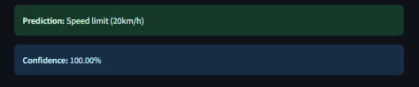

# 🚦 Traffic Sign Detection System

A deep learning-based system to detect and classify traffic signs from images. This project utilizes Convolutional Neural Networks (CNNs) trained on the German Traffic Sign Recognition Benchmark (GTSRB) dataset and is deployed as an interactive web application using Streamlit.

---

## 📌 Table of Contents

- [Introduction](#introduction)
- [Dataset](#dataset)
- [Model Architecture](#model-architecture)
- [Results](#results)
- [Web Application](#web-application)
- [Screenshots](#screenshots)

---

## 🧠 Introduction

Traffic signs play a crucial role in regulating road traffic and ensuring safety. This project automates the process of recognizing traffic signs from images using deep learning. It aims to assist in the development of driver assistance systems and autonomous vehicles.

---

## 📊 Dataset

- **Name:** German Traffic Sign Recognition Benchmark (GTSRB)
- **Classes:** 43 traffic sign categories
- **Samples:** ~50,000 images
- **Image Size:** Resized to 32x32 RGB
- **Source:** [GTSRB Official](https://benchmark.ini.rub.de/gtsrb_news.html)

---

## 🏗️ Model Architecture

The model is built using **TensorFlow/Keras** and follows a CNN-based architecture:

---

## 📈 Results

| Metric        | Value        |
|---------------|--------------|
| Training Acc  | ~99.89%      |
| Validation Acc| ~99.97%      |
| Test Acc      | ~98.55%      |

---

## 🌐 Web Application

The trained model is deployed using **Streamlit**, allowing users to:

- Upload traffic sign images
- Instantly predict the class
- View the predicted label and confidence score

### ⚙️ Features:

- Real-time prediction
- Clean and intuitive UI
- Error handling for unsupported formats

---

## 🖼️ Screenshots

### Homepage

### Upload & Prediction

### Result

---

